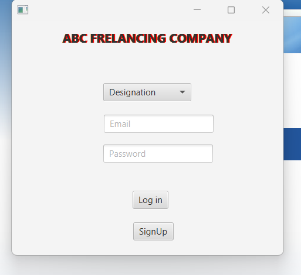
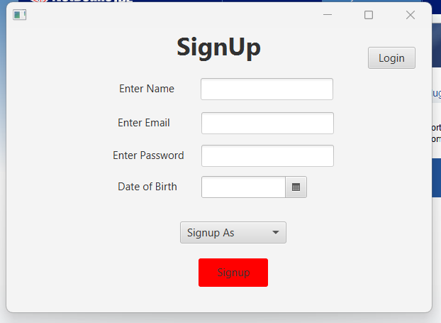

# 🚀 Freelancing Company Management System

Welcome to the Freelancing Company Management System, a Java-based application designed to streamline the operations of a freelancing company. This project employs Object-Oriented Programming (OOP) principles and utilizes JavaFX for creating a user-friendly graphical interface.

## 🚀 Introduction

The Freelancing Company Management System is designed to facilitate the efficient management of a freelancing company's operations. The application includes a login page and signup pages for different user roles, providing a secure and organized environment for users to access and interact with the system.

## ✨ Features

- **User Authentication**: Secure login and signup functionality for CEO, customers, managers, and interns.
- **Role-Based Access Control**: Different access levels and functionalities based on user roles.
- **Scene Builder Integration**: Graphical user interfaces are created using Scene Builder for an intuitive and visually appealing experience.
- **Task Management**: Track and manage tasks, projects, and deadlines.
- **Communication**: Seamless communication channels for effective collaboration among team members.

## 🚀 Getting Started

### 🛠️ Prerequisites

Before running the application, ensure you have the following installed:

- Java Development Kit (JDK)
- JavaFX SDK
- Scene Builder

### 🚀 Installation
1. Clone the repository to your local machine.
2. Open the project in your preferred Java IDE.
3. Configure the project with the necessary libraries and dependencies.
4. Run the application.

## 🌟 User Roles

### 🎩 CEO
The CEO has access to all features and functionalities, overseeing the entire freelancing company's operations.
### 👤 Customer
Customers can create accounts, view available services, and submit project requests. They have limited access to project progress.
### 🧑‍💼 Managers
Managers are responsible for task allocation and project management. They can assign tasks to interns and track project status.
### 🧑‍💻 Interns
Interns have restricted access, primarily focused on completing assigned tasks and updating task status.
## 🖼️ Screenshots

### 🌐 Login Page

### 🌐 Signup Page

## 💻 Technologies Used
- Java
- JavaFX
- Scene Builder

